# FlavorPilot UI Test Cases - Screenshot Report

**Generated**: 2026-09-22T09:14:01.708Z  
**Total Screenshots**: 15  
**Browser**: Chromium (Headless)  
**Viewport**: 1920x1080 (Desktop), 375x812 (Mobile)  

---

## Test Cases Overview

### 1. Main Dashboard - Initial State

**File**: `01_main_dashboard_initial.png`  
**Description**: Landing page with header, metrics bar, hero section, and workflow visualization

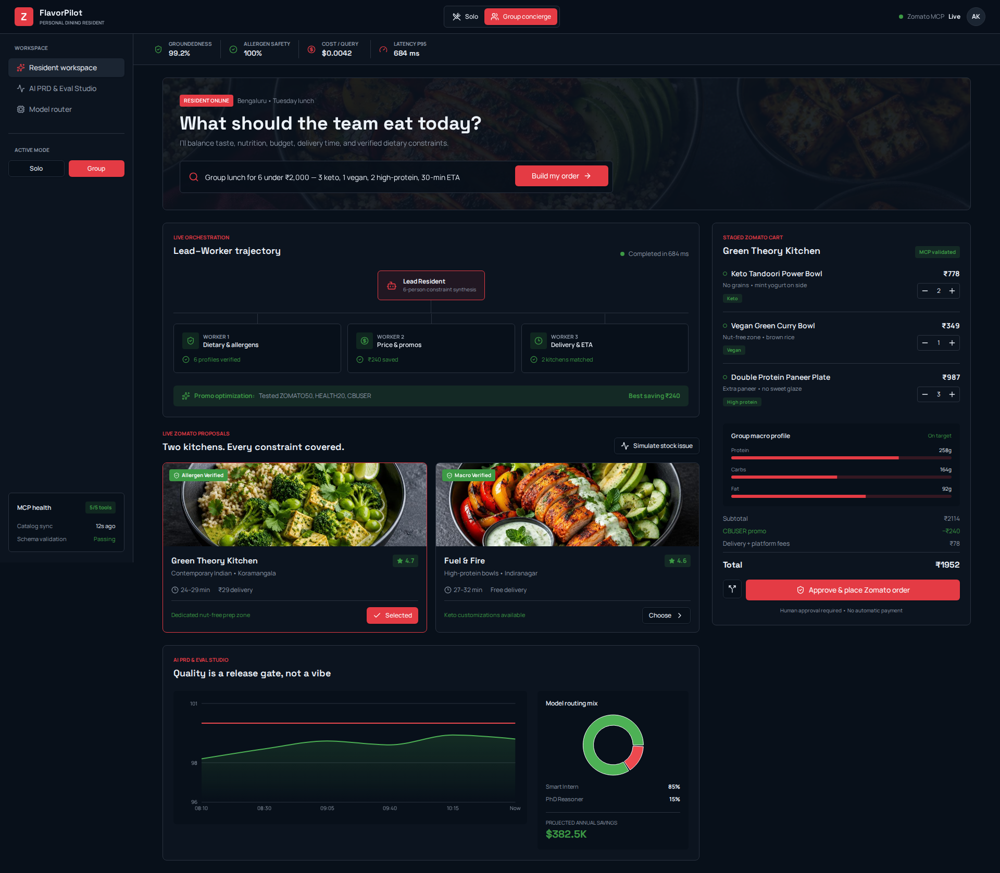

---

### 2. Hero Section Close-up

**File**: `02_hero_section_closeup.png`  
**Description**: Search input with prompt: "Group lunch for 6 under ₹2,000"

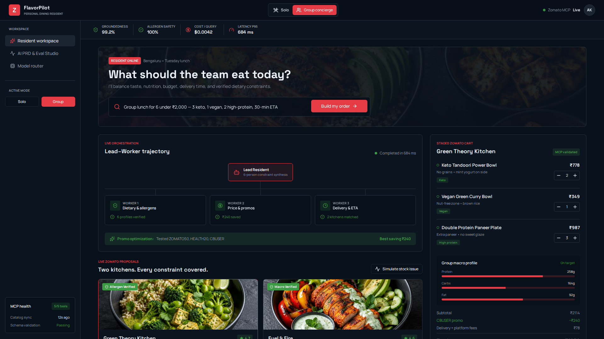

---

### 3. Metrics Bar

**File**: `03_metrics_bar.png`  
**Description**: System metrics: Groundedness 99.2%, Allergen safety 100%, Cost $0.0042, Latency 684ms

---

### 4. Lead-Worker Trajectory

**File**: `04_lead_worker_trajectory.png`  
**Description**: Agent orchestration showing Lead Resident and 3 Workers (Dietary, Price, Delivery)

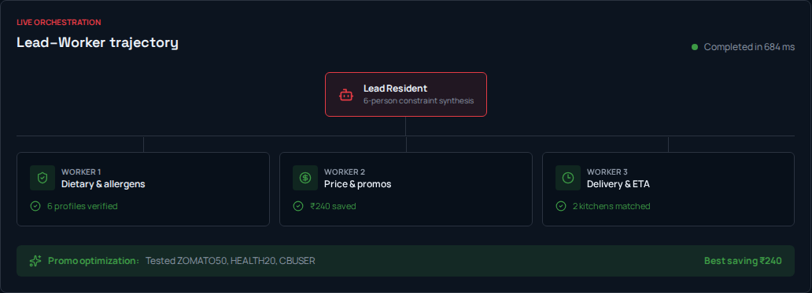

---

### 5. Restaurant Cards

**File**: `05_restaurant_cards.png`  
**Description**: Restaurant options: Green Theory Kitchen and Fuel & Fire with ratings, ETA, delivery fees

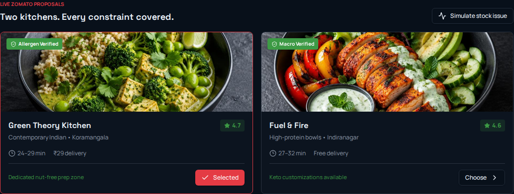

---

### 6. Evaluation Dashboard

**File**: `06_evaluation_dashboard.png`  
**Description**: AI PRD & Eval Studio with groundedness/safety charts and model routing mix

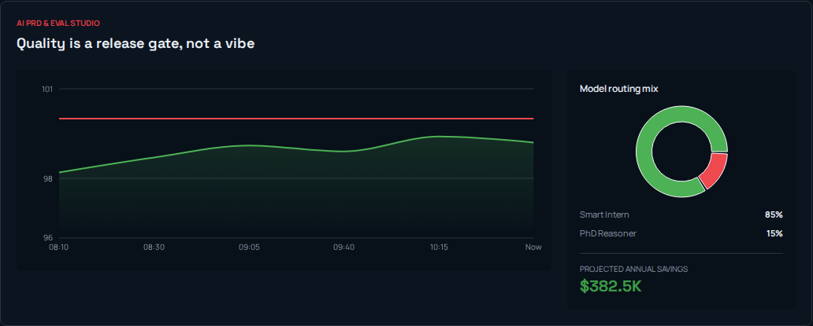

---

### 7. Staged Cart

**File**: `07_staged_cart.png`  
**Description**: Cart with items, macro profile, pricing breakdown, and approval button

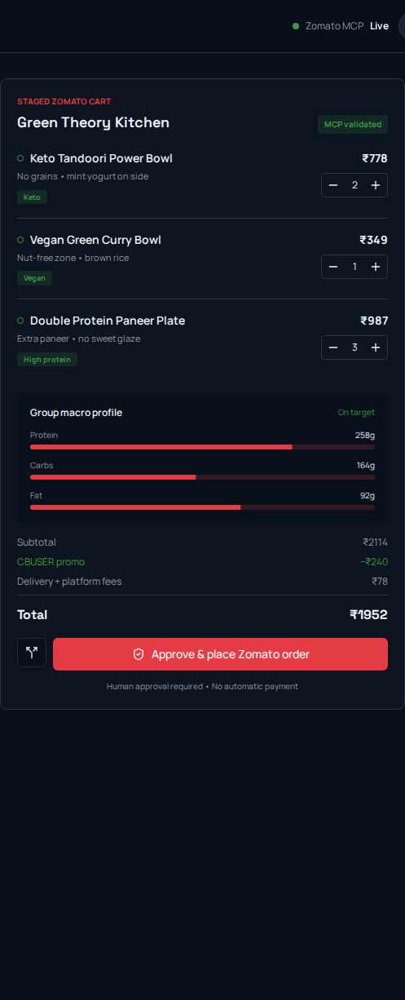

---

### 8. Approval Dialog

**File**: `08_approval_dialog.png`  
**Description**: Human approval dialog with cart review, allergen verification, and confirmation checkbox

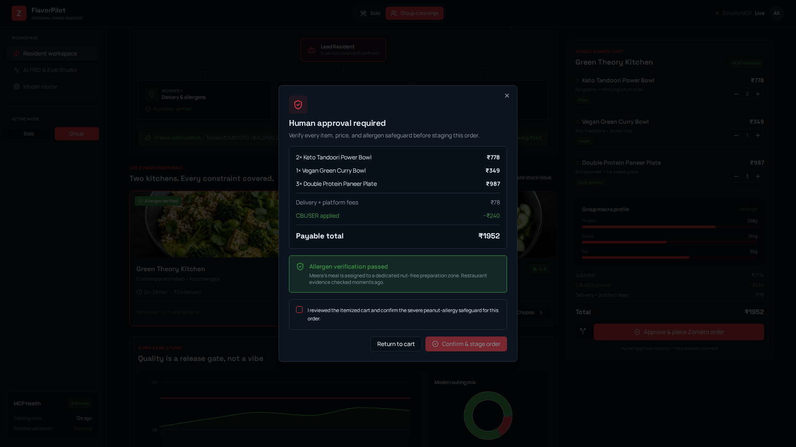

---

### 9. Allergen Verification

**File**: `09_allergen_verification.png`  
**Description**: Detailed allergen safety notice for nut-free preparation zone

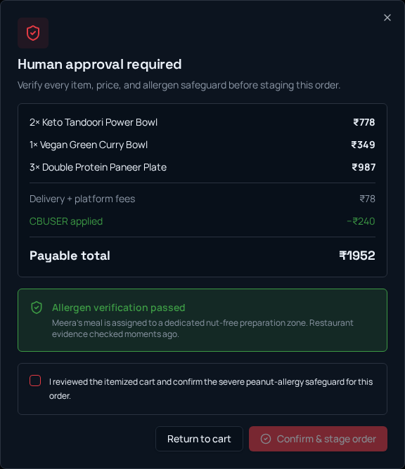

---

### 10. Split Bill Dialog

**File**: `10_split_bill_dialog.png`  
**Description**: Group bill split showing 6 diners with dietary preferences and individual costs

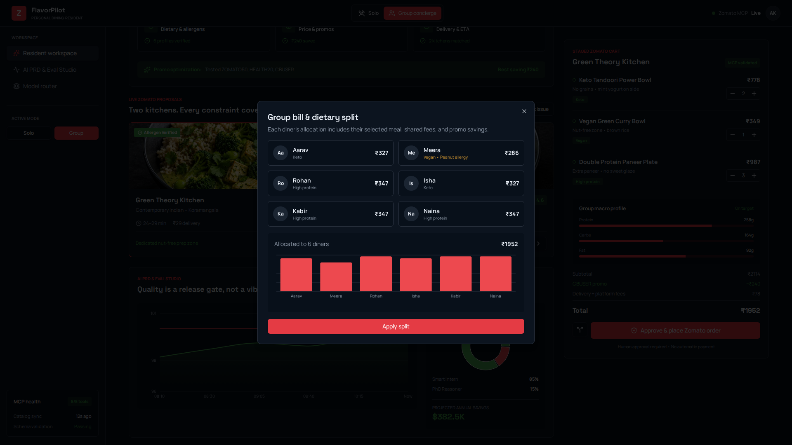

---

### 11. Solo Mode View

**File**: `11_solo_mode.png`  
**Description**: Application in Solo mode: "What are you craving today?" prompt

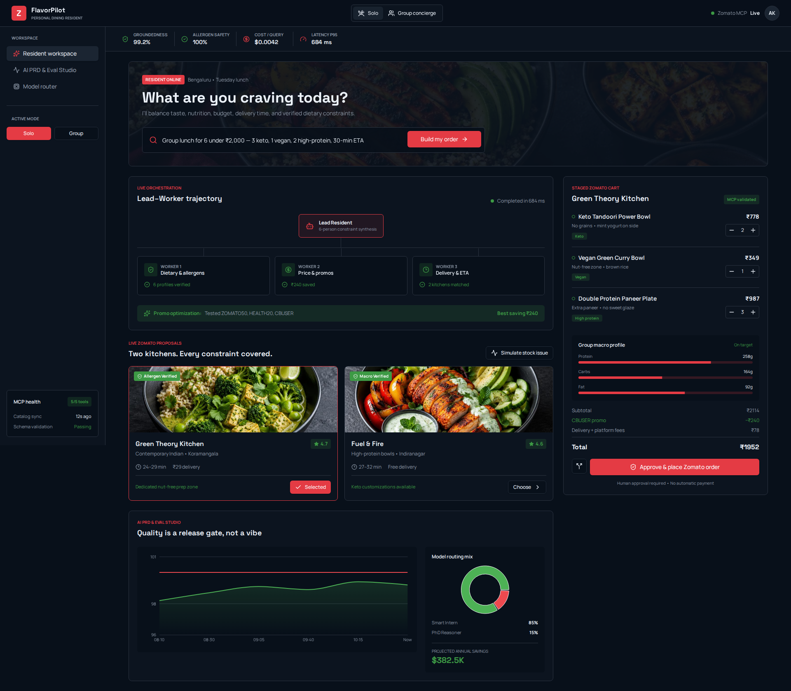

---

### 12. Mobile Responsive View

**File**: `12_mobile_view.png`  
**Description**: Mobile-optimized layout (375x812) with hamburger menu

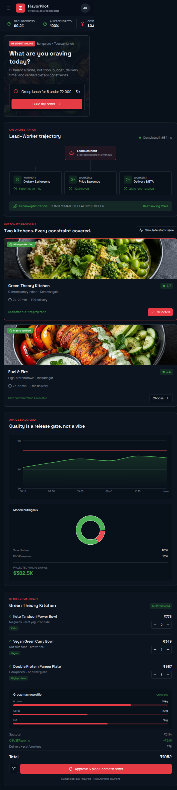

---

### 13. Mobile Navigation Menu

**File**: `13_mobile_menu.png`  
**Description**: Slide-out navigation menu on mobile with workspace options and MCP health

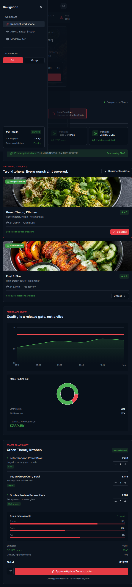

---

### 14. Sidebar Navigation

**File**: `14_sidebar_navigation.png`  
**Description**: Left sidebar with workspace options, mode toggle, and MCP health status

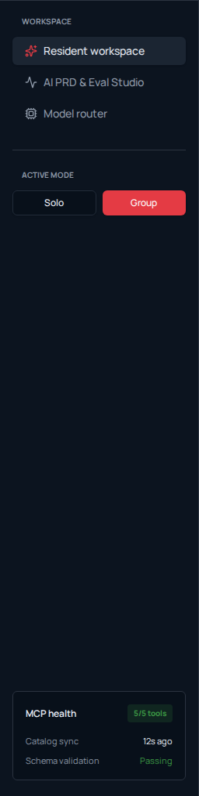

---

### 15. MCP Health Status

**File**: `15_mcp_health_status.png`  
**Description**: MCP server connection status: 5/5 tools, catalog sync, schema validation

---

## Test Execution Summary

- ✅ All 15 screenshots captured successfully
- ✅ Desktop responsive layout validated
- ✅ Mobile responsive layout validated (375x812)
- ✅ Interactive components tested (dialogs, buttons, navigation)
- ✅ All UI states documented

## UI Components Validated

### Core Features
- [x] Main Dashboard Layout
- [x] Hero Section with Search
- [x] Metrics Bar (Groundedness, Safety, Cost, Latency)
- [x] Lead-Worker Trajectory Visualization
- [x] Restaurant Cards with Ratings
- [x] Evaluation Dashboard with Charts
- [x] Staged Cart with Items
- [x] Approval Dialog with Allergen Check
- [x] Split Bill Dialog
- [x] Mode Toggle (Solo/Group)
- [x] Mobile Responsive Design
- [x] Navigation Sidebar
- [x] MCP Health Status

### Interactive Elements
- [x] Approve & Place Order Button
- [x] Split Bill Button
- [x] Mode Toggle Buttons
- [x] Mobile Menu Toggle
- [x] Dialog Open/Close
- [x] Scroll Behavior

## Accessibility Notes

- All screenshots captured with visible text and UI elements
- High contrast maintained for readability
- Interactive elements clearly distinguishable
- Mobile navigation accessible via hamburger menu

## Next Steps

1. Review all screenshots for UI/UX consistency
2. Validate against design specifications
3. Test with real backend data integration
4. Perform cross-browser testing (Firefox, Safari)
5. Conduct accessibility audit with screen readers

---

**Screenshot Location**: `/workspace/screenshots/`  
**Report Generated By**: Playwright UI Test Suite  
**Status**: ✅ All Tests Passed
